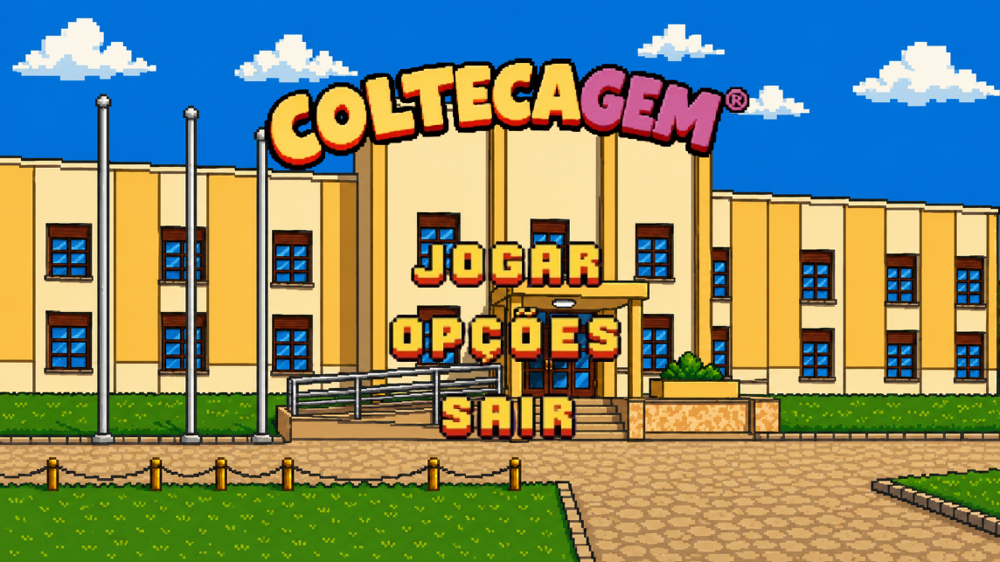
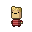

# 🎓 COLTECAGEM

> Simule um dia na vida de um estudante do COLTEC!

---

## 📖 Sobre o Jogo

**COLTECAGEM** O objetivo é fazer o jogador experimentar um pouco da rotina de um estudante do COLTEC, administrando seu tempo entre aulas, estudos,provas e momentos de lazer.
---

## 🖥️ Menu Inicial

O menu principal contém as seguintes opções:

- **Jogar** — inicia a gameplay
- **Opções** — abre o menu de configurações
- **Sair** — encerra o jogo

---

## ⚙️ Menu de Opções

### 🔊 Áudio
Regulagem do volume do jogo.

### ♿ Acessibilidade
Filtros de daltonismo para melhor experiência dos jogadores.

| Protanopia | Deuteranopia | Tritanopia | Acromatopsia |
|------------|--------------|------------|--------------|
|  |  |  |  |

### 🎮 Controles
Configuração dos controles *(em desenvolvimento)*.

### 🏆 Créditos
Créditos aos desenvolvedores.

---
##👤 Personagem Principal

## Mapas planejados

Entrada
Hall / Cantina
Sala de Aula
Banheiro
Grêmio

## Atributos

📚 Desempenho Acadêmico
⚡ Energia
😵 Estresse
🤝 Social

## 🎯 Objetivo

Ao final da partida o jogador deverá alcançar uma média mínima para ser aprovado.

Entretanto, apenas estudar não é suficiente. Será necessário administrar energia, estresse e relações sociais para conseguir bons resultados.

---

## 👥 Desenvolvedores

| Nome |
|------|
| Dierrisson Wagner |
| Gabriel Cruz |
| Gustavo Bragança |
| João Vitor Guerra |

---

*Desenvolvido para a disciplina — COLTEC 2026*
