# 🎓 COLTECAGEM

> Simule um dia na vida de um estudante do COLTEC!

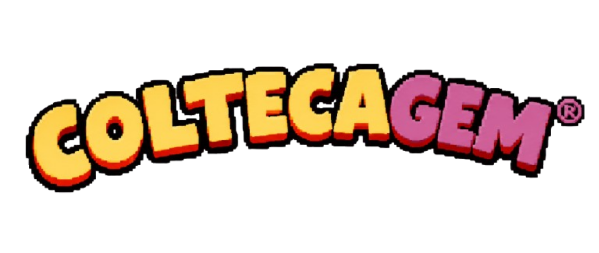

---

## 📖 Sobre o jogo

**Coltecagem** coloca o jogador na pele de um estudante do COLTEC, administrando
sua rotina entre aulas, provas, estudo, sono, alimentação e vida social. A
cada bloco de horário o jogador decide como agir — e cada decisão empurra
seus atributos (energia, estresse, vida social e desempenho acadêmico) para
lados diferentes. Não existe um único caminho "certo": o jogo tem **8 finais
possíveis**, e o objetivo declarado (tirar nota alta) muitas vezes entra em
conflito com se manter saudável e ter amigos ao longo do caminho.

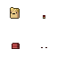

---

## 🎮 Mecânica

### Atributos

| Atributo | Ícone | Efeito geral |
|---|---|---|
| Desempenho Acadêmico | 📚 | Sobe com aula/estudo; decide aprovação e parte dos finais |
| Energia | ⚡ | Gasta com aula/estudo; recuperada dormindo/comendo |
| Estresse | 😵 | Sobe com aula/estudo/prova; cai dormindo/entrosando/matando aula |
| Social | 🤝 | Sobe entrosando/matando aula/comendo com amigos |

Todos os atributos ficam sempre entre 0 e 100. Se o **estresse chega a 90**,
ações "produtivas" (ir à aula, estudar, entrosar) ficam bloqueadas até o
jogador se recuperar. Se a **energia chega a 0**, estudar e ir à aula passam
a render bem menos.

### Ações do dia a dia

Cada bloco de horário dá um número limitado de "fichas de ação". O jogador
escolhe entre:

- **Ir à aula** — maior ganho de desempenho, mas custa energia e gera estresse
- **Matar aula** — sem custo de energia; ganha social, mas perde desempenho
- **Estudar** — mesmo tipo de efeito da aula, só que mais fraco
- **Comer** — recupera energia (com amigos, também recupera social)
- **Dormir** — recupera bastante energia e reduz estresse
- **Entrosar** — ganha social e reduz estresse

Ir à aula e matar aula também podem acontecer "em tempo real": o
`GerenciadorDeEventos` acompanha quanto tempo o jogador passou dentro ou fora
da sala durante o período de aula e escala o efeito proporcionalmente.

### Minigames

Tarefas e interações no mapa podem abrir um minigame (ex: arrumar a bagunça,
fugir de algo, um desafio de reflexo). O `GerenciadorDeMinigames` pausa o dia,
guarda a posição exata do personagem no mapa e a restaura ao final. **Não
existe "perder" de verdade**: vencer o minigame dá a recompensa cheia em
atributos, e perder ainda dá metade da recompensa — o jogo nunca pune o
jogador com uma tela de Game Over por errar um minigame.

### Prova e finais

A nota da prova é o desempenho acadêmico atual + um fator sorte aleatório.
Dependendo da combinação final de desempenho, estresse, energia e social, o
jogador recebe um dos 8 finais: Aluno Exemplar, Gênio Solitário, O Mais
Popular da Turma, Sobreviveu por Pouco, Vida Social em Primeiro Lugar,
Burnout Acadêmico, Repetente ou Formado na Média.

---

## 🖥️ Menu Inicial

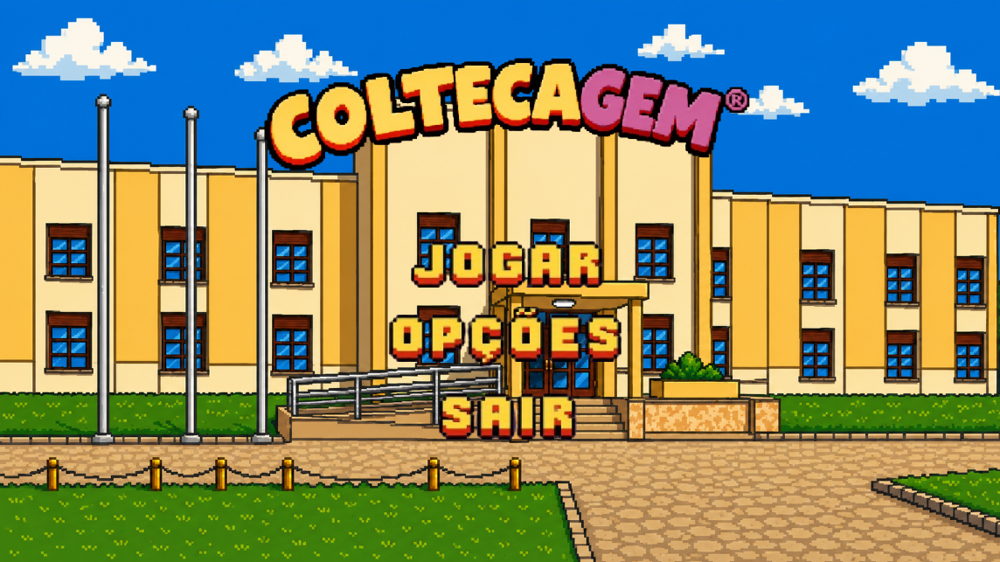

O menu principal contém as seguintes opções:

- **Jogar** — inicia a gameplay
- **Opções** — abre o menu de configurações
- **Sair** — encerra o jogo

---

## ⚙️ Menu de Opções

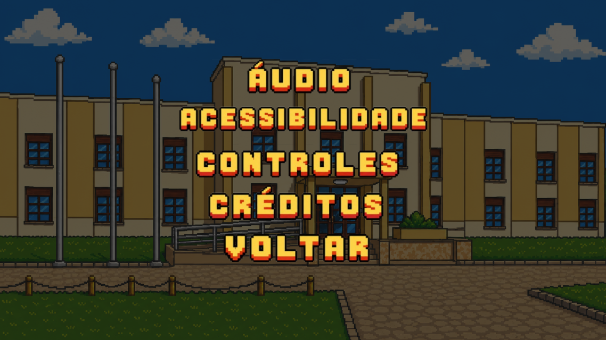

### 🔊 Áudio
Regulagem do volume do jogo.

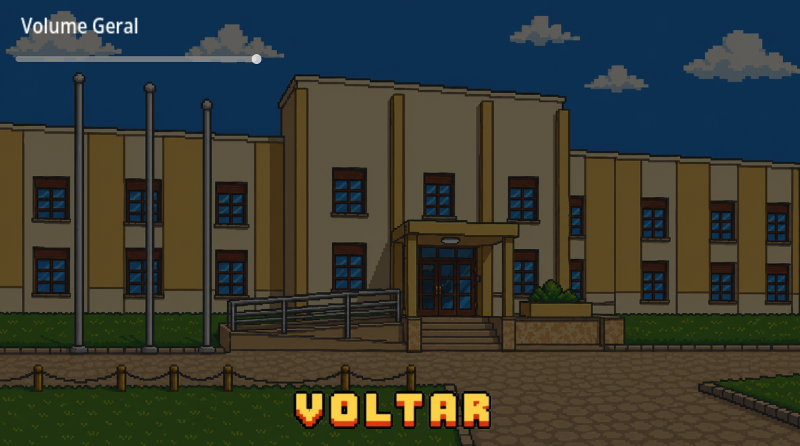

### ♿ Acessibilidade

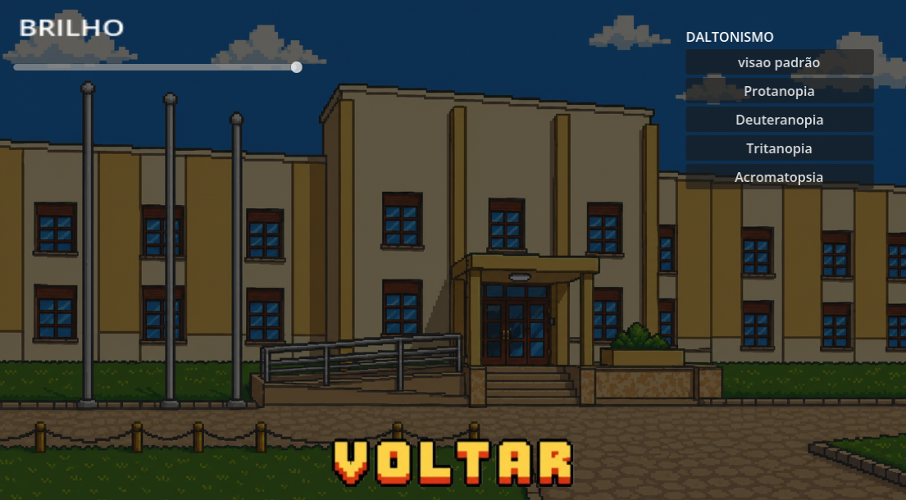

O jogo conta com um menu de acessibilidade próprio, sempre disponível a
partir do menu de Opções:

- **Brilho** — slider para ajustar o brilho geral da tela
- **Filtros de daltonismo** — simulação/correção para Protanopia,
  Deuteranopia, Tritanopia e Acromatopsia

| Protanopia | Deuteranopia | Tritanopia | Acromatopsia |
|------------|--------------|------------|--------------|
| 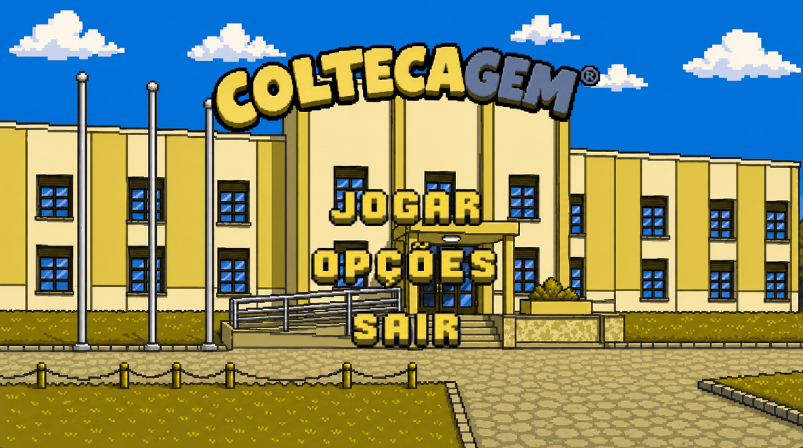 | 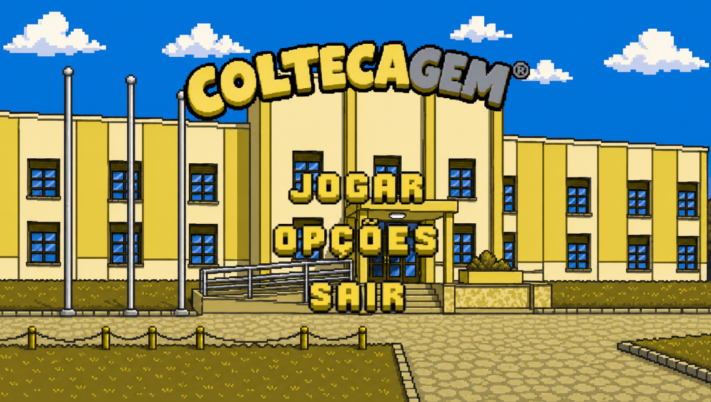 | 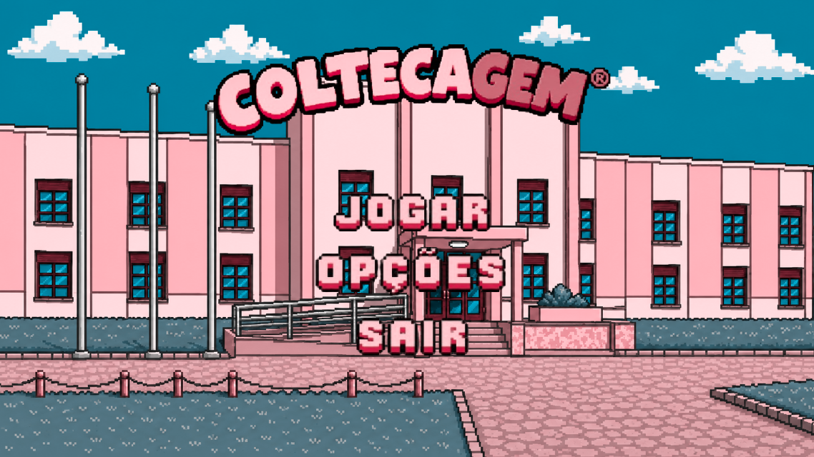 | 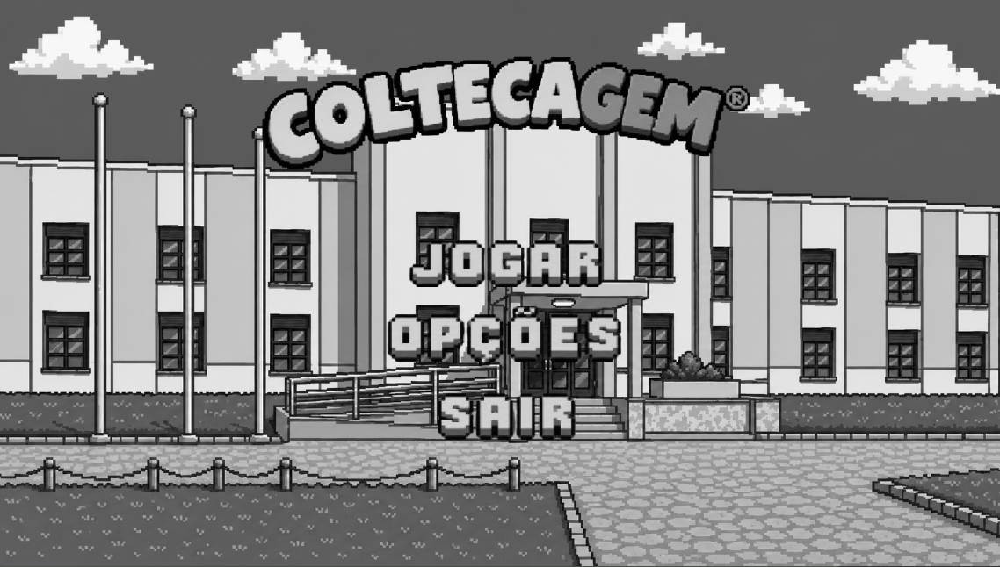 |

### 🎮 Controles
Configuração dos controles *(em desenvolvimento)*.

### 🏆 Créditos
Créditos aos desenvolvedores.

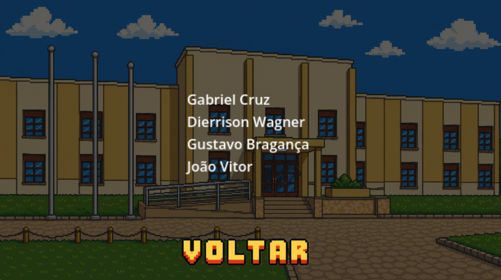

---

## 👤 Personagem Principal

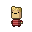

---

## 🗺️ Mapas planejados

- Entrada
- Hall / Cantina
- Sala de Aula
- Banheiro
- Grêmio

---

## 🎯 Objetivo

Ao final da partida o jogador deverá alcançar uma média mínima para ser
aprovado (nota ≥ 60).

Entretanto, apenas estudar não é suficiente. Será necessário administrar
energia, estresse e relações sociais para conseguir bons resultados — e
para alcançar os finais alternativos do jogo.

---

## 🧩 Créditos de terceiros

Os minigames em `minigames/` são adaptados do projeto open source
**Minigame Madness**, convertido para Godot 4 e reorganizado para se
integrar ao Coltecagem.

---

## 👥 Desenvolvedores

| Nome |
|------|
| Dierrisson Wagner |
| Gabriel Cruz |
| Gustavo Bragança |
| João Vitor Guerra |

---

*Desenvolvido para a disciplina — COLTEC 2026*
